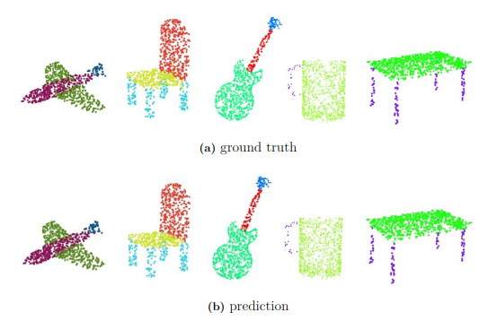

# My implementation of Point Transformer

Point Transformer is a self-attention neural network specifically designed for 3D point cloud learning.<br>
- it was proposed by Zhao et al. in 2021 ([Paper](https://openaccess.thecvf.com/content/ICCV2021/html/Zhao_Point_Transformer_ICCV_2021_paper.html?ref=https://githubhelp.com)).
- it achieved outstanding results in three tasks: object classification, object part segmentation, and semantic scene segmentation.

## Requirements

Make sure the following environments are installed.

```
python
numpy
torch
tqdm
hydra-core
omegaconf
einops
```

You can utilize the yaml file in the *requirements* folder by
```
conda env create -f point_transformer_env.yml
conda activate point_transformer_env
```

Then, install *pointops* by

```
cd lib/pointops/
python setup.py install
cp build/lib.linux-x86_64-cpython-39/pointops_cuda.cpython-39-x86_64-linux-gnu.so .
```

The code was tested on Ubuntu 22.04 LTS and GeForce RTX 3090.

## Classification

### Data

You can download the **ModelNet40** dataset from [here](https://shapenet.cs.stanford.edu/media/modelnet40_normal_resampled.zip). Unzip and move it to `data/modelnet40_normal_resampled`.

### Run

```
python train_cls.py
```

### Results

| Method                    | mAcc | OA   |
|---------------------------|------|------|
| Point Transformer's paper | 90.6 | 93.7 |
| My implementation         | 90.7 | 93.1 |

## Part Segmentation

### Data

You can download the **ShapeNet-Part** dataset from [here](https://shapenet.cs.stanford.edu/media/shapenetcore_partanno_segmentation_benchmark_v0_normal.zip). Unzip and move it to `data/shapenetcore_partanno_segmentation_benchmark_v0_normal`.

### Run

```
python train_partseg.py
```

### Results

| Method                    | cat. mIoU | ins. mIoU |
|---------------------------|-----------|-----------|
| Point Transformer's paper | 83.7      | 86.6      |
| My implementation         | 83.0      | 86.2      |

Visualization of object part segmentation results:

<p align="center">
  
</p>

## Acknowledgements and Motivation

In my master's thesis project, I need to use Point Transformer.
Before implementation, I learned from and compared several repositories on GitHub. I will describe the two most relevant repositories. <br>

[qq456cvb/Point-Transformers](https://github.com/qq456cvb/Point-Transformers) was the first one I attempted to use.
However, it did not utilize CUDA to implement the operations like kNN, FPS, and IDW interpolation, which I discussed with the developer ([discussion issue](https://github.com/qq456cvb/Point-Transformers/issues/36)). 
Additionally, the manual cache-clearing in the code is time-consuming.
On the positive side, this codebae is easy to read and manipulate, which facilitated my initial experimentation. <br>

Then, I discovered the codebase [Pointcept](https://github.com/Pointcept/Pointcept), a comprehensive repository with implementations of many neural network models.
However, its implementation is not 100% compatible with my requirements. 
In their implementation, the data needs to be formed in the offset mode, as *(N, X)*, which is actually more versatile.
Nevertheless, the data used in the experiments of my project is better suited for processing in batch mode, as *(B, N, X)*. <br>

Finally, I decided to create a customized version of Point Transformer that aligns perfectly with my requirements.
For the foundational blocks in Point Transformer, I referred to the implementation in [Pointcept](https://github.com/Pointcept/Pointcept) and adapted it to handle data in batch mode.
For operations such as kNN, FPS, and IDW, I utilized the CUDA library from [PointWeb](https://github.com/hszhao/PointWeb)
Moreover, the training and evaluation scripts are based on those from  [qq456cvb/Point-Transformers](https://github.com/qq456cvb/Point-Transformers) and [yanx27/Pointnet_Pointnet2_pytorch](https://github.com/yanx27/Pointnet_Pointnet2_pytorch).